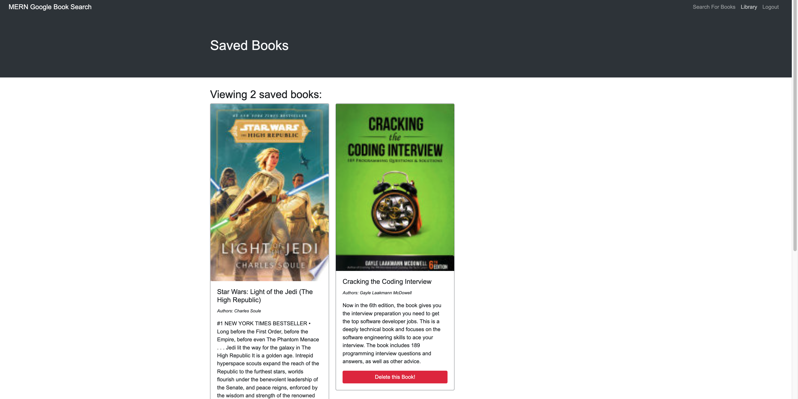
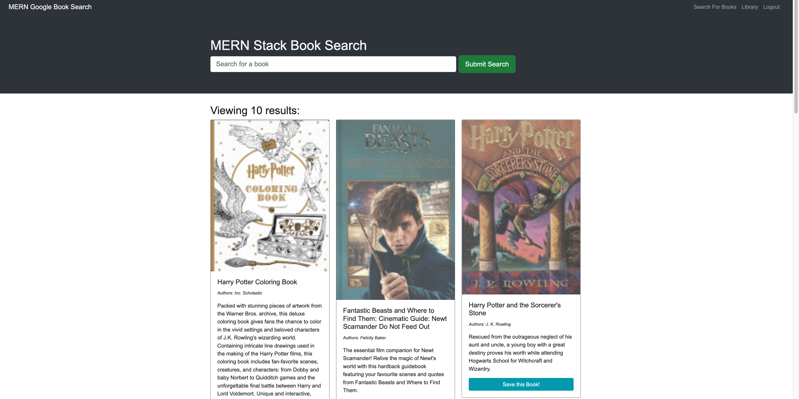

<a href = "title"></a>

# Book Search Engine

## Table of Contents

- [Title](#title)
- [User Story](#story)
- [Description](#description)
- [Images](#images)
- [Links](#links)
- [Contact](#contact)

<a href = "story"></a>

## User Story

```md
AS AN avid reader
I WANT to search for new books to read
SO THAT I can keep a list of books to purchase
```

<a href = "description"></a>

## Description

This is a book search engine using the Google Books API. You can login or signup, search for books, add those books to your library (or delete them if you choose). 

<a href = "images"></a>

## Images

</img>
</img>

<a href = "links"></a>

## Links

[Repository](https://github.com/joecliffordofficial/bookSearchEngine)

[Video](chrome-extension://mmeijimgabbpbgpdklnllpncmdofkcpn/app.html#/files/26802304-869a-42b2-yfda-487a1788b05d)

[Heroku](https://book-search-engine-mern-jc.herokuapp.com/)

<a href = "contact"></a>

## Contact

If you wish to contact me please feel free to reach out!

[LinkedIn](https://www.linkedin.com/in/joe-clifford/)
[GitHub](https://github.com/joecliffordofficial)